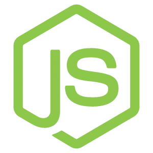
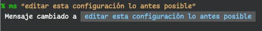

<h1 align="center">
  My Dotfiles
  
</h1>

> Mi configuración para un entorno **GNU/Linux** que no de pena. Y usando **Fedora** como distribución.

## Requisitos

Primero que nada, es recomendable tener tu distribución actualizada. Así que abres la terminal que tienes por default y ejecutas el comando.

```bash
sudo dnf update
```

### Kitty 

Kitty es un emulador de terminal de código abierto y altamente configurable que ofrece características únicas como representación gráfica avanzada, soporte de imágenes y aceleración de hardware. Para mas detalles visita su [sitio oficial](https://sw.kovidgoyal.net/kitty/).

La instalación de _kitty_ es fácil, ya que se encuentra dentro del repositorio oficial de `Fedora`, así que para instalarla solo ejecutamos el siguiente comando.

```bash
sudo dnf install kitty
```

También tengo una configuración recomendada para comenzar con _kitty_, la puedes encontrar [**aquí**](./kitty)

### Git 

Git es un sistema de control de versiones distribuido para rastrear cambios en archivos y coordinar el trabajo en proyectos de desarrollo de software.

Viene por defecto en _fedora_, para otras distribuciones tendrás que acceder a su [sitio web](https://git-scm.com/)

### Node.js 

Es un entorno de tiempo de ejecución de JavaScript de código abierto que permite construir aplicaciones en el lado del servidor.

Instalare _Node.js_ con un administrador de versiones llamado [fnm](https://github.com/Schniz/fnm). Para ello he preparado una guia de instalación que puedes ver [**aquí**](./other-settings/node.md).

### ZSH 

Zsh es un potente y versátil intérprete de comandos de Unix con características avanzadas de autocompletado y personalización, para mas detalles visite [Z _shell_](https://zsh.sourceforge.io/).

He hecho una guia para instalar _zsh_ junto con un Framework potente y liviano llamado [zimfw](https://github.com/zimfw/zimfw). Todo ello la encuentras [**aquí**](./zsh)

## Editores de Código

### NeoVim 

Es la evolución de _Vim_, un editor de texto que potencia la edición y programación con características modernas (se configura con _Lua_), extensibilidad y mayor eficiencia en la manipulación de código.

Si quieres la ultima version estable, por suerte esta en el repositorio de _Fedora_ y la instalas con este comando:

```bash
sudo dnf install -y neovim python3-neovim
```

<details>
    <summary>para Nightly</summary>

- Habilite el repositorio `COPR` para _neovim-nightly_.
  ```bash
  sudo dnf copr enable agriffis/neovim-nightly
  ```
- Hacer una actualización: `sudo dnf update`
- y para finalizar lo instalas
  ```bash
  dnf install -y neovim python3-neovim
  ```
  </details>

Al instalar _Nvim_, esta estará limpia y sin ninguna configuración. Si no sabes como hacerlo o tienes poca experiencia puedes Probar mi configuración, te la dejo [**aquí**](shelshelllhttps://github.com/grChad/nvim)

### Vs-Code 

Visual Studio Code (VSCode) es un editor de código fuente gratuito y altamente personalizable desarrollado por Microsoft, escrita en _TypeScript_, popular por su amplia extensibilidad y herramientas integradas para desarrollo.

Mi confinación se encuentra [**aquí**](./vs-code)

### Helix 

Helix se denomina a si mismo, como un editor post-moderno. Y algo de cierto tiene, hace uso de la edición modal (basado en modos) como _Vim_ o _NeoVim_, también tiene compatibilidad con LSP (language sever protocol) y lo mejor es que trae _Tree-sitter_ por default.

Aunque no tiene todavía, una forma de crear plugins y extenderlo. Es muy practico y liviano para edición de código casual.

Habilite el repositorio `COPR` para helix:

```bash
sudo dnf copr enable varlad/helix
```

Luego actualiza: `sudo dnf update`

Y al final lo instalas con:

```bash
sudo dnf install helix
```

Tengo una configuración para Helix, la encuentras [**aquí**](./helix)

## GNOME Shell Extensions

Don módulos adicionales que permiten personalizar y mejorar la experiencia del entorno de escritorio GNOME al agregar características y modificar su apariencia y comportamiento.

Ademas de los muchos que existen ya por default en tu sistema, puedes agregar las que quieras. Yo solo instalare unas que me son de utilidad.

### Resource Monitor

Es una extensión de GNOME Shell que monitorea el uso de recursos del sistema como CPU, RAM, disco, red y los muestra en la barra superior de GNOME Shell.

Solo tengo activa la CPU y RAM. Pero me son de mucha utilidad. La encuentras [aquí](https://extensions.gnome.org/extension/1634/resource-monitor/)

### Simple Message

Es una extensión para agregar mensajes simples en la barra Superior de GNOME. Es como un TODO, que te indica que tienes algo pendiente por hacer.

Su uso puede no ser tan accesible, ya que se requiere de la aplicación `extensiones` de la tienda de software de Fedora para poder interactuar con ella.

Pero si eres programador y perezoso como yo, puedes usarlo por la `terminal` como un _hack_. Primero instalas _Simple Message_ desde [aquí](https://extensions.gnome.org/extension/5018/simple-message/)

Luego ingresas a tu configuración de _zsh_, `.zshrc` dentro de la ruta del usuario. Y dentro de ella pegas este código.

```bash
# Alias para cambiar un mensaje de una extensión de gnome: 'Simple-Message'
function set_simple_message() {
  local message="$1"

  if [ -z "$message" ]; then
    dconf write /org/gnome/shell/extensions/simple-message/message "''"
    echo " $(tput setaf 1)♻️ Mensaje Eliminado"
  else
    dconf write /org/gnome/shell/extensions/simple-message/message "\"$message\""
    echo " Mensaje cambiado a $(tput setab 0)$(tput setaf 6) $message "
  fi
}
alias ms='set_simple_message'
```

El alias que uso es `ms`, si no te gusta puedes cambiarlo por el que quieras.

Para usarlo es tan simple como escribir por `terminal(kitty)` lo siguiente

```bash
ms "editar esta configuración lo antes posible"
```

Por la terminal veras algo como esto:

<p align="center">
    
</p>

Y el mensaje también aparecerá en la barra superior de GNOME.

### Space Bar

Extensión de GNOME Shell que reemplaza el botón 'Actividades' con una barra de espacios de trabajo similar a i3.

Básicamente me aparecen indicadores del numero de espacio de trabajo en el que me encuentro. Pero esta se puede modificar con colores, estilos y tamaños. Y la mejor utilidad es que puedes renombrarlos con el `click derecho`.

Ejemplo, puedes renombrar al primer espacio de trabajo que esta por defecto como **1** y **Dev**, y al **2** como **Webs** y lo que quieras.

La extensión la instalas desde [aquí](https://extensions.gnome.org/extension/5090/space-bar/)

## Otros:

- Librerías de React Native CLI que uso, [aquí](./other-settings/react-native-cli.md)
- Como crear un enlace simbólico
- Problemas con el WiFi
- Instalar Latex
- Comandos para YouTube.
- Comandos para Terminal
- Herramientas para la [_terminal_](./other-settings/apps_for_terminal.md)
- Herramientas para el [_escritorio_](./other-settings/apps_desktop.md)
- Como instalar [_neovim_](./other-settings/neovim.md)
- comandos para la terminal, [aquí](./other-settings/comandos_linux.md)
- Grabar una ISO desde terminal [aquí](./other-settings/gravarISO.md)
