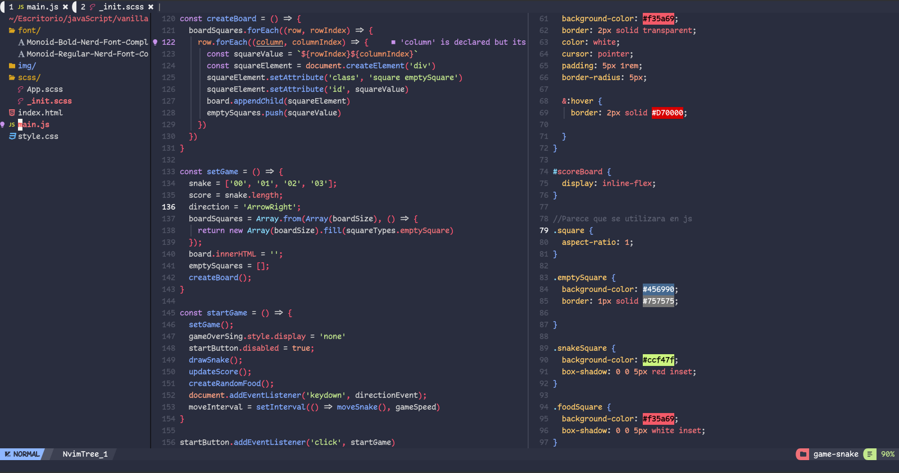
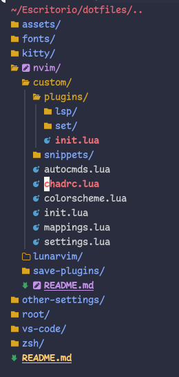

# Configuración :
> Configuraciones personales de  basadas en **NvChad** y **lunarvim**.

## NvChad

### Uso
Agregue la carpeta `custom/` dentro de `nvim/lua/.`.

Luego guardas y sales. Al ingresar **`:PackerSync`**, Esto instalara los plugins y demas cambios realizados. Y ya para finalizar un **`PackerCompile`**

### plugins agregados
+ **romgrk/barbar.nvim**: plugin para mostrar el buffer, mas agradable a mi gusto.
+ **m-demare/hlargs.nvim**: Me colorea los parametros de las funciones desde la declaracion, hasta cuando se usa con el mismo color.
+ **windwp/nvim-ts-autotag**: De lo mas util para renombrar etiquetas de **_html_**, ya sea dentro de html, js, o donde detecte su sintaxis.
+ **stevearc/dressing.nvim**: Ventana flotante para mejor experiencia renombrando variables del codigo, en nvim-tree, telescope...
+ **ggandor/lightspeed.nvim**: Para moverte a traves del codigo mas rapido.
+ **KabbAmine/vCoolor.vim**: Para usar paleta de colores y su selector dentro del editor.
+ **mrshmllow/document-color.nvim**: Pigmento de colores para **_tailwind_**.
+ **jose-elias-alvarez/typescript.nvim**: Complemento lsp, para **_typescript_**.
+ **williamboman/mason.nvim**: Administrador de packetes para nvim. Administra servidores LSP, DAP, linters, formateadores.
+ **williamboman/mason-lspconfig.nvim**: El instalador automatico de **_mason.nvim_**.
+ **iamcco/markdown-preview.nvim**: Para previsualizar codigo de markdown a travez del navegador. Impresindible.
+ **gaoDean/autolist.nvim**: Auto-completado de listas inteligentes para **_markdown_**, indispensable...

### plugins modificados
+ **kyazdani42/nvim-tree.lua**: configuracion a mi gusto, tambien en color.
+ **kyazdani42/nvim-web-devicons**: se personaliza tanto los iconos y los colores de algunos iconos.

+ **nvim-treesitter/nvim-treesitter**: para agregar alguna configuracion.
+ **goolord/alpha-nvim**: se habilita.
+ **neovim/nvim-lspconfig**: Para agregar las configuraciones de los servidores
+ **L3MON4D3/LuaSnip**: Para agregar una ruta de snippets custom como **_vsCode_**.

### plugins desabilitados
+ **NvChad/ui**: Mas preciso, **tabufline**, que es uno de los 2 complementos **(?)**, dentro de **ui**, Para ser reemplazado por **_barbar_**.

## Lunarvim
> .. en proceso.
