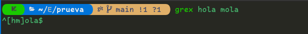
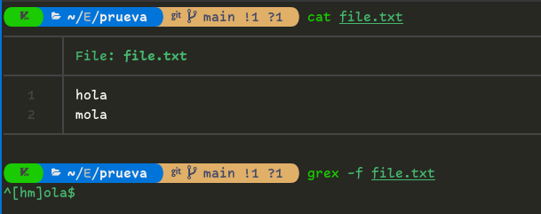
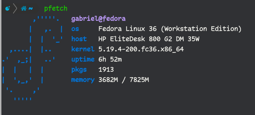

# Programas para la Terminal 

## Grex: 

grex es una biblioteca, así como una utilidad de línea de comandos que pretende simplificar la tarea a menudo complicada y tediosa de crear expresiones regulares. Lo hace generando automáticamente una única expresión regular a partir de casos de prueba proporcionados por el usuario. Se garantiza que la expresión resultante coincida con los casos de prueba a partir de los cuales se generó.

### Install

```shell
cargo install grex
```

Aunque también funciona con:

<code>**(brew | cargo | choco | huber | scoop) install grex**</code>

### usar

Tan facil como colocar en la **_terminal_**, <code>**grex hola mola**</code> y obtendrias algo como <code>**^\[hl]ola$**</code>, que es la expresion regular.

<p align="center"></p>

También podrías tener las coincidencias en un archivo y buscar a través de ellas:
<code>**grex -f file.txt**</code> y obtener el mismo resultado.

<p align="center"></p>

Para mas informacion en el **_GitHub_** de [**grex**](https://github.com/pemistahl/grex).

## pfetch

Es una bonita herramienta de información del sistema escrita en POSIX sh. Utilizando funciones integradas en el propio lenguaje

### Install Unix/Linux

- con [_wget_](https://www.gnu.org/software/wget/?) o con [_git_](https://git-scm.com/), **Solo elige uno!**

```shell
wget https://github.com/dylanaraps/pfetch/archive/master.zip
git clone https://github.com/dylanaraps/pfetch.git
```

Si usaste _wget_, tienes que descomprimir el archivo **.zip**

```shell
unzip master.zip
```

Instale el binario usando el comando install:

```shell
sudo install pfetch-master/pfetch /usr/local/bin/
```

Ahora prueve con el comando **_pfetch_**.

<p align="center"></p>

## winehq

Wine permite correr software de _Windows_ en **_linux_**. Con Wine se puede instalar y correr aplicaciones igual que se hacia en _windows_ y la puedes descargar desde [**_aqui_**](https://wiki.winehq.org/Download).

### uso

Dar click en un programa **.exe** de _windows_ y solo eso, claro que al inicio pueda necesitar instalar otros programas...

## webP

WebP es un formato de imagen moderno que proporciona una compresión con y sin pérdida superior para imágenes en la Web. Con WebP, los webmasters y los desarrolladores web pueden crear imágenes más pequeñas y enriquecidas que hacen que la Web sea más rápida.

Para instalarlo desde el repositorio de _Fedora_, ejecutamos el siguiente comando.

```shell
sudo dnf install libwebp
```

#### Uso

Usa _cwebp_ en la línea de comandos para convertir archivos de imagen PNG o JPEG al formato WebP. Puedes convertir un archivo de imagen PNG en una imagen WebP con un rango de calidad de 80 con el siguiente comando:

```shell
cwebp -q 80 image.png -o image.webp
```

Usa _dwebp_ en la línea de comandos para convertir los archivos de imagen WebP al formato PNG o PPM. Puedes convertir un archivo de imagen WebP, por ejemplo, image.webp, en una imagen PNG con el siguiente comando:

```shell
dwebp image.webp -o image.png
```

## unrar

Es una utilidad para descomprimir archivos que se encuentran comprimidos en formato _RAR_. Para _Linux_ y en _Fedora_, encontramos un equivalente con el mismo nombre.

Lo instalamos usando el siguiente comando.

```shell
sudo dnf install unrar
```

#### Uso

1. Para descomprimir un archivo _.rar_ es tan simple como:
   ```shell
   unrar e name_file.rar
   ```
2. Para descomprimirlo pero, en una ruta determinada.
   ```shell
   unrar e name_file.rar ~/path/directory/
   ```
3. Para verificar si un archivo _.rar_ se encuentra dañado o tiene algún problema.
   ```shell
   unrar t name_file.rar
   ```

## Flutter SDK

Puedes instalar Flutter desde el [sitio oficial](https://docs.flutter.dev/get-started/install/linux), tanto manual como por Snap.

<details>
    <summary>Snap</summary>

```shell
sudo snap install flutter --classic
```

</details>

<details>
    <summary>Instalar manualmente</summary>

1. Descargue el siguiente paquete de instalación para obtener la última versión estable del SDK de Flutter [Aquí](https://docs.flutter.dev/release/archive?tab=linux)
2. Extraiga el archivo en la ubicación deseada. Por ejemplo:

   ```shell
   cd ~/development
   tar xf ~/Downloads/flutter_linux_3.10.6-stable.tar.xz
   ```

3. Añade el Path de flutter en tu **.zsrhc**:
   ```shell
   export PATH=$HOME/`pwd`/flutter/bin:$PATH
   ```
4. Opcionalmente, pre-descargue los binarios de desarrollo:
   ```shell
   flutter precache
   ```

¡Ya estás listo para ejecutar los comandos de Flutter!

</details>

### Ejecute Flutter doctor

Ejecute el siguiente comando para ver si hay alguna dependencia que necesite instalar para completar la configuración (para una salida detallada, agregue el flag -v):

```shell
flutter doctor
```

Este comando verifica su entorno y muestra un informe en la ventana del terminal. El SDK de Dart se incluye con Flutter; no es necesario instalar Dart por separado. Verifique la salida cuidadosamente para ver si hay otro software que pueda necesitar instalar o realizar otras tareas (que se muestran en negrita).

Por ejemplo:

```shell
[-] Android toolchain - develop for Android devices
    • Android SDK at /Users/dash/Library/Android/sdk
    ✗ Android SDK is missing command line tools; download from https://goo.gl/XxQghQ
    • Try re-installing or updating your Android SDK, visit https://docs.flutter.dev/setup/#android-setup for detailed instructions.
```
