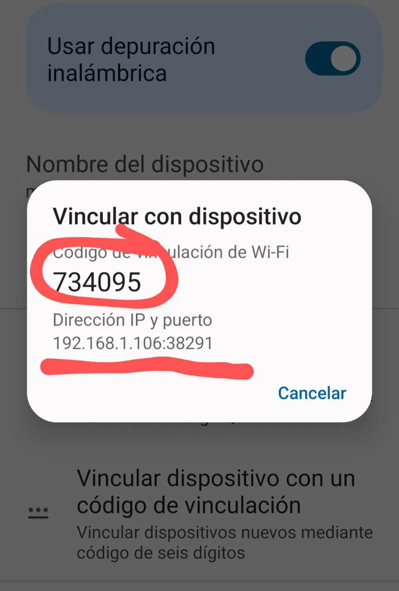
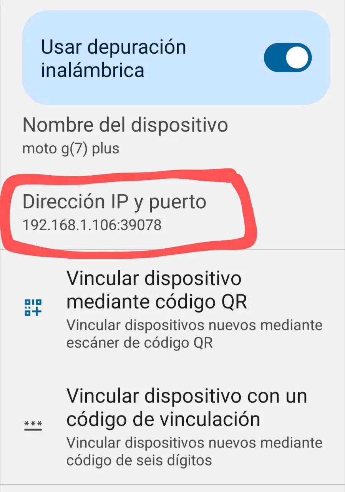

<h1 align="center">Depuración WiFi</h1>

Para depurar un dispositivo móvil o tablet con la computadora y crear o emular una app.

**Requisitos**:

- _Android 11_ o una version mas actual.
- Estar conectados en la misma _red_, tanto la pc como el móvil.

### paso 1

- Habilitar las `Opciones de desarrollador`
- Habilitar `Depuración inalámbrica`

### paso 2

- Ingresar a las opciones de `Depuración inalámbrica`
- Seleccionar `Vincular dispositivo con un código de vinculación`
<div align="center">
  
</div>

- En la `terminal` del Pc, escribir lo siguiente:
  ```bash
    adb pair 192.168.1.106:38291
  ```
- Luego pedirá la contraseña y se lo proporcionas:
  ```bash
  Enter pairing code: 734095
  ```
- El resultado completo debería verse así:
  ```bash
  adb pair 192.168.1.106:38291
  Enter pairing code: 734095
  Successfully paired to 192.168.1.106:38291 [guid=adb-ZY225FS87B-FulD6X]
  ```

### paso 3

Si obtuviste `Successfully` como respuesta entonces todo esta `ok` y podemos continuar.

<div align="center">
  
</div>

- En la terminal del PC, conectase con el móvil por `ip:puerto` a:
  ```bash
  adb connect 192.168.1.106:39078
  ```
- Si todo va bien se vera así:
  ```bash
  connected to 192.168.1.106:39078
  ```

### end

Verificamos si realmente esta conectado al PC por WiFi.

```bash
adb devices
```

Todo ira bien se no muestra algo como esto:

```bash
List of devices attached
192.168.1.106:39078 device
```
