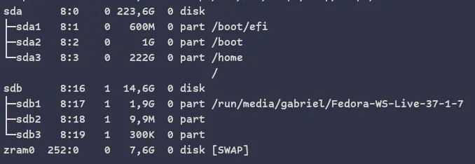
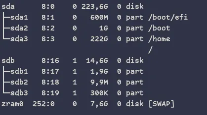
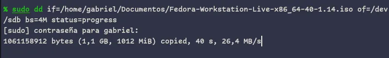

<h1 align="center">Como grabar una imagen ISO</h1>

> Me refiero a un sistema Operativo, como **windows o Linux**

### verificamos los medios de almacenamiento
Cada que se requiera ejecutamos el comando **`lsblk`**,
esto nos mostrara una lista de las particiones de nuestro medio dé almacenamiento local y alguna unidad externa.

<div align="center">
  
</div>

### desmontar

Nos interesa el media **sdb** que esta en la ruta `/dev/sdb`, como cualquier medio de almacenamiento. Ahora no fijamos si esta montada alguna partición de la misma, como la partición **sda** que tiene 4 sub-particiones como `sda1` que tiene montada el `\boot\efi`.

En la sub-partición **`sdb1`** de **`sdb`**, esta montada `/run/media/gabriel/Fedora-WS-Live-37-1-7`, para desmontarla tenemos que ejecutar el comando:

```bash
sudo umount /run/media/gabriel/Fedora-WS-Live-37-1-7
```

<div align="center">
  
</div>

### Gravar la ISO

Todo se resume a este comando.

```bash
sudo dd if=path/to/xxxx.iso of=/dev/sdb bs=4M status=progress
```

- **`sudo`** El permiso de usuario para cosas de sistema.
- **`dd`** El comando para gravar disponible en _Linux_.
- **`if`** Ruta o `PATH` del archivo **ISO** en tu directorio, ejemplo: `/home/gabriel/Documentos/Fedora-Workstation-Live-x86_64-40-1.14.iso`.
- **`of`** Ruta o `PATH` de la unidad _USB_, donde se quiera grabar, para este caso `sdb` que se encuentra en `/dev/sdb`.
- **`bs`**: Con temor a equivocarme es **bites por segundos**, se pueden colocar otros valores, pero el mas recomendado y el que nunca me fallo es: `bs=4M`.
- **`status`**: Su nombre lo dice, pare ver el status en tiempo de ejecución. Por defecto coloco `status=progress`, ignoro si tiene otros valores.

<div align="center">
  
</div>

Esperas por unos minutos para tenerlo listo.

### expulsar USB
Ejecutamos: `sudo eject /dev/sdb`.

Y vivieron felices por siempre ...**`end`**.
