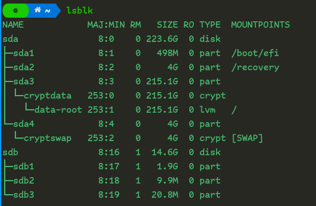

# Como grabar una imagen ISO
> Me refiero a un sistema Operativo **SO**, **windows e Linux**

### verificamos los medios de almacenaliento
Cada que se requiera ejecutamos el comando <code>**lsblk**</code>,
esto nos mostrara una lista de las particiones de nuestro medio de almacenaliento local y alguna unidad externa.

### Ubicar y desmontar
Ingresamos una unidad de almacenamiento (**USB**) y con <code>**lsblk**</code>
ubicamos cual es. Puede verse algo asi:



Nos interasa el media **sdb** que esta en la ruta <code>**/dev/sdb**</code>, como cualquier medio de almacenamiento. Ahora no fijamos si esta montada alguna particion de la misma, como la particion **sda** que tiene 4 particiones y **sda1** tiene montada el **boot** ( <code>**sda1  ---> /boot/efi**</code>).

Ninguna particion **sdb** esta montada pero si lo estubiese se desmonta asi:
<code>**sudo umount /boot/efi**</code>, hasta verse como esta **sdb** en la imagen. Siempre puedes comprobar los cambios con el comando <code>**lsblk**</code>.

### Gravar la ISO
La parte mas interesante:
  ```bash
  sudo dd if=path/to/xxxx.iso of=/dev/sdb bs=4M status=progress
  ```
* **dd**: El comando para gravar desponible en **Linux**, (mac & windows no se).
* **if**: ruta de la **ISO** en su sistema, ejemplo: <code>**$HOME/Documentos/Fedora-Workstation-Live-x86_64-36-1.5.iso**</code>
* **of**: ruta de la unidad **USB**, donde se quiera grabar, para este caso **sdb** en la ruta:<code>**/dev/sdb**</code>.
* **bs**: Con temor a equibocarme es **bites por segundos**, se pueden colocar otros valores, pero el mas recomendado y el que nunca me fallo es: <code>**bs=4M**</code>.
* **status**: Su nombre lo dice, pare ver el status en tiempo de ejecucion. Por defecto coloco <code>**status=progress**</code>, ignoro si tiene otros valores.

Luego se espera... Te Comes unos doritos y ya...

### expulsar USB
Ejecutamos:<code>**sudo eject /dev/sdb**</code>

Y vivieron felices por siempre &emsp; &emsp; &emsp; _**end**._
