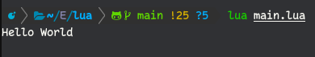
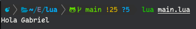
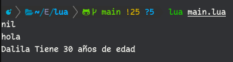
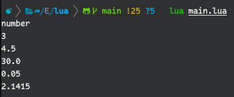

# Guía de inicio para Lua 

Lua es un lenguaje de secuencias de comando potente, eficiente, liviano e integrable. Es compatible con la programación de procedimientos, la programación orientada a objetos, la programación funcional, la programación basada en datos y la descripción de datos.

Lua combina una sintaxis de procedimiento simple con poderosas construcciones de descripción de datos basadas en matrices asociativas y semántica extensible....


## Hola Mundo
Como cualquier lenguaje, para iniciarse se suele escribir un 'Hello World', como no tengo creatividad hare lo mismo.
```lua
print('Hello World')
```
Al ejecutar esto en tu terminal obtendras:
<p align="center"></p>

## Los comentarios
La sintaxis para comentar en **Lua** es **'-'** doble.
```lua
-- Comentarios en una línea

--[[
    Comentarios
    de muchas
    líneas
--]]
```
Ahora usaremos los comentarios junto con codigo.
```lua
-- pintar en la pantalla
print('Hola Gabriel') -- Pintar Hola Gabriel
-- print('Hello World')
```
<p align="center"></p>

Los comentarios solo sirven como anotacion, de una tarea, describir un error, un Hack... Pero el interprete de **Lua** simplemente los ignora

## Variables
Las variables son espacios en memoria que almacenan valores. Hay 3 tipos de variables en **lua**: variables globales, variables locales y cambios de tablas (segun la documentacion). Solo veremos los 2 primeros.

```lua
Mal_definidad = hola -- Variable Ganeral
Bien_definida = 'hola' -- Variable General
_G.edad = 30 -- Variable General Correctamente definida
local nombre = 'Dalila'

print(Mal_definidad)
print(Bien_definida)
print(nombre .. ' Tiene ' .. edad .. ' años de edad')
````
<p align="center"></p>

* las variables mal definidas o _undedined_ tendran como valor **nil**, un equivalente a **null**.
* las variables tendran un ambito **global** siempre que no se declare explicitamente como **local**. Asi pudes usar **`_G.`** como prefijo o **no usarlo!!!**
* Una valiable **global** se declara con mayuscula <code>**Bien_definida**</code>, no es obligatorio pero si tienes linter este se quejara. <code></code>

## Tipos de datos
### nil (vacio)
representa un valor no valido y equivalente a **false** en las expresiones condicionales.

### boolean
Como cualquier otro lenguaje, un boleano solo tiene 2 posibles valores: **true** (verdadero) y **false** (falso). Aunque tambien se usa **nil**.
```lua
local is_good = true
local is_hot = false
```

## number
Para **lua** solo se usa **double** (doble precisión) 64-bits y 52-bits se usan para almacenar valores enteros exactos.
```lua
local number_a = 3
local number_b = 4.5
local number_c = 3e+1
local number_d = 0.5e-1
local number_e = 3.1415-01

print(type(number_a)) -- tipo de dato -> type(valor)
print(number_a)
print(number_b)
print(number_c)
print(number_d)
print(number_e)
```
<p align="center"></p>

### string (cadena de texto)
se pueden representar con cadenas simples o dobles, cuestión de gustos.
```lua
local primer_string = 'hola soy el String simple'
local segundo_string = "Eu sou a corda dupla, que fala português"
```

### array, objetos, matrices, tablas.
Es como una mezcla de todo. Por convención la llamare tabla pero de a poco, que cuesta adaptarse.
```lua
local array = {10, 20, 30, 40, 50}

-- en lua se cuenta desde 1, no desde 0
print(array[1]) -- escribe '10'
print(#array) -- escribe '5', hasta aqui como un (array.length)
```

Hasta aquí, nada fuera de lo normal, si bienes de un lenguaje donde el indice comienza por cero podría sorprenderte algo.

```lua
local array_raro = {
  10, 'un String', 30, [16] = 600
}

print(array_raro[1])   -- escribe '10'
print(array_raro[2])   -- escribe 'un String'
print(array_raro[16])  -- escribe '600'
print(#array_raro)     -- escribe '3'????
```
Ahora ya no parece una lista, mas bien una mezcla con un objeto.

Como siempre hay una explicación, en el codigo <code>**print(array_raro[1])**</code>, se pinta o imprime por consola el **indice 1** de la tabla **array_raro** como valor de retorno <code>**10**</code>.

En el código <code>**print(array_raro[16])**</code>, se llama al **indice 16** que tiene valor **600**. De esto se concluye que el valor de los indices **4** al **15** son **nill**

Por ultimo, <code>**print(#array_raro)**</code> retorna **3**; por que, solo muestra la longitud de datos consecutivos con valor no nulos. Y reconoce que hay un vació desde el indice **3** al incide **16**.

Ahora viene un twist, asi que prepárate.

```lua
local pizza = {
    precio = 500,
    ['tipo'] = 'Napolitana',
    ['cantidad de queso'] = 20000
}

print(pizza.precio)       -- escribe '500'
print(pizza['precio'])    -- escribe '500', es lo mismo
print(pizza.tipo)         -- escribe 'Napolitana'
print(pizza['cantidad de queso'])   -- escribe '20000'
```

```lua
local otros = {
   nombre = 'Gabriel',
   saludar = function(self)
      return 'un saludo a ' .. self.nombre
   end
}

print(otros['saludar'](otros))
print(otros.saludar(otros))
print(otros:saludar())

-- los 3 son validas y retornan 'un saludo a Gabriel'
```
