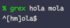
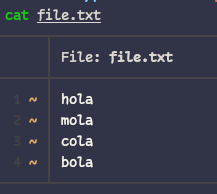

<h1 align="center">Herramientas para terminal</h1>

## 

Grex es una biblioteca, así como una utilidad de línea de comandos que pretende simplificar la tarea a menudo complicada y tediosa de crear expresiones regulares.

### Install

Usando `cargo` de _Rust_.

```shell
cargo install grex
```

Aunque también funciona con:

<code>**(brew | cargo | choco | huber | scoop)** install grex</code>

### usar

Tan fácil como colocar en la terminal, `grex hola mola` y obtendrías algo como `^\[hl]ola$`, que es la expresión regular.

<div align="center"></div>

También podrías tener las coincidencias en un archivo y buscar a través de ellas:
`grex -f file.txt` y obtener el mismo resultado.

<div align="center">
  
  
</div>

Para mas información en [grex](https://github.com/pemistahl/grex).

## ripgrep

Herramienta de búsqueda orientada a líneas, que busca recursivamente el directorio para un patrón de expresiones regulares. Recomendable para usar con _NeoVim_.

#### Install

Con _Fedora_ `sudo dnf install ripgrep`. para otros visitar [aquí](https:/github.com/BurntSushi/ripgrep?tab=readme-ov-file#installation).

## webP

WebP es un formato de imagen moderno que proporciona una compresión con y sin pérdida superior para imágenes en la Web. Con WebP, los webmasters y los desarrolladores web pueden crear imágenes más pequeñas y enriquecidas que hacen que la Web sea más rápida.

Para instalarlo desde el repositorio de _Fedora_, ejecutamos el siguiente comando.

```shell
sudo dnf install libwebp
```

#### Uso

Usa _cwebp_ en la línea de comandos para convertir archivos de imagen PNG o JPEG al formato WebP. Puedes convertir un archivo de imagen PNG en una imagen WebP con un rango de calidad de 80 con el siguiente comando:

```shell
cwebp -q 80 image.png -o image.webp
```

Usa _dwebp_ en la línea de comandos para convertir los archivos de imagen WebP al formato PNG o PPM. Puedes convertir un archivo de imagen WebP, por ejemplo, image.webp, en una imagen PNG con el siguiente comando:

```shell
dwebp image.webp -o image.png
```

## unrar

Es una utilidad para descomprimir archivos que se encuentran comprimidos en formato _RAR_. Para _Linux_ y en _Fedora_, encontramos un equivalente con el mismo nombre.

Lo instalamos usando el siguiente comando.

```shell
sudo dnf install unrar
```

#### Uso

1. Para descomprimir un archivo _.rar_ es tan simple como:
   ```shell
   unrar e name_file.rar
   ```
2. Para descomprimirlo pero, en una ruta determinada.
   ```shell
   unrar e name_file.rar ~/path/directory/
   ```
3. Para verificar si un archivo _.rar_ se encuentra dañado o tiene algún problema.
   ```shell
   unrar t name_file.rar
   ```

## Love2D

LÖVE es un marco _increíble_ que puedes usar para hacer juegos 2D en Lua. Es gratis, de código abierto y funciona desde _windows, Mac Os X, Linux, Android e Ios_.

#### Install

En _Fedora_, se instala a través de la paquetería `dnf`.

```bash
sudo dnf makecache --refresh
sudo dnf install love
```

Eso es todo. Ahora en la terminal puedes llamarlo **`love`** y veras algo como esto.

<div align="center">
  
</div>

## MySQL

> [!NOTE]
> la instalación viene de la información brindada de [docs](https://docs.fedoraproject.org/e-US/quick-docs/installing-mysql-mariadb/) de _fedoraproject.org_.

#### Agregar el repositorio MySQL a Fedora

Descargue el paquete de versión proporcionado por Oracle desde [aquí](https://dev.mysql.com/downloads/repo/yum/) Una vez descargado, instalar usando `dnf`:

```shell
sudo dnf install <ruta absoluta del archivo>
```

#### Instalación de MySQL en Fedora

```shell
sudo dnf install mysql-community-server
```

#### Inicie el servicio MySQL y habilitar al iniciar sesión:

```shell
sudo systemctl start mysqld
sudo systemctl enable mysqld
```

busque la contraseña predeterminada. Por razones de seguridad, MySQL genera una clave raíz temporal. Tenga en cuenta que MySQL tiene políticas de seguridad aún más estrictas que MariaDB.

#### Configurar MySQL antes del primer uso

```shell
sudo mysql_secure_installation
```

Luego, responde las preguntas de seguridad como prefieras. o simplemente decir sí a todos ellos.

#### usar MySQL

```shell
sudo mysql -u root -p
```

#### remover MySQL

Sugiero eliminar de la siguiente manera, la forma más adecuada y segura sin eliminar muchas dependencias es:

```shell
sudo rpm -e --nodeps mysql-community-libs mysql-community-common mysql-community-server
```
