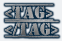
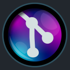

# Como uso Vs-Code 
> Mi segunda eleccion a 
, Pero para **Tailwind** ,
**Deno**  o
**Styled-components**  son mas convenientes.

## PLugins
### Auto Rename Tag 
Practicamente me renombra la etiquetas html, xml o su sintaxis en otros archivos como js, ts, jsx, tsx, html, xml, ejs...
Descarga desde las extenciones de **Vs Code** o [**Aqui**](https://marketplace.visualstudio.com/items?itemName=formulahendry.auto-rename-tag).

### EditorConfig for VS Code 
Me crea un archivo de configuracion **.editorconfig** donde puedo editar el tipo de sangria, tabs, espaciados y más por archivo **FileType**.
Descarga desde las extenciones de **Vs Code** o [**Aqui**](https://marketplace.visualstudio.com/items?itemName=EditorConfig.EditorConfig).

## Error Lens 
Me muestra los errores del dignostico del **language server** a lado del código.
Descarga desde las extenciones de **Vs Code** o [**Aqui**](https://marketplace.visualstudio.com/items?itemName=usernamehw.errorlens).

## ESLint 
es un linter para **{ js, jsx, ts, tsx }** y te hace trabajar con unas reglas de codigo como **standard** y otras.

Para que se ejecute inmediatemente se guarde el documento revise el [**settings.json**](./settings.json).
Y Descarga desde las extenciones de **Vs Code** o [**Aqui**](https://marketplace.visualstudio.com/items?itemName=dbaeumer.vscode-eslint).

## GitLens - Git supercharged 
Me da más informacion para trabajar con git, los cambios en la barra de signos del lado izquierdo y más.
Descarga desde las extenciones de **Vs Code** o [**Aqui**](https://marketplace.visualstudio.com/items?itemName=eamodio.gitlens).

## Import Cost 
Dice lo que pesa el uso de la bibliotaca que se importa.
Descarga desde las extenciones de **Vs Code** o [**Aqui**](https://marketplace.visualstudio.com/items?itemName=wix.vscode-import-cost).

## Material Icon Theme 
Iconos geniales para todos los folders y ficheros con sus respectivos **fileTypes**, para cada caso...
Descarga desde las extenciones de **Vs Code** o [**Aqui**](https://marketplace.visualstudio.com/items?itemName=PKief.material-icon-theme).

## One Dark Pro 
El mejor tema para un editor de código de toda la historia...
Descarga desde las extenciones de **Vs Code** o [**Aqui**](https://marketplace.visualstudio.com/items?itemName=zhuangtongfa.Material-theme).

## Prettier -Code formatter 
Formateador de documentos, solo lo uso con js, y si te molesta el **';'** revisa mi [**settings.json**](./settings.json).

Descarga desde las extenciones de **Vs Code** o [**Aqui**](https://marketplace.visualstudio.com/items?itemName=esbenp.prettier-vscode).

## Plugins para VSCode
* Dobri Next - dobbbri
* indent-rainbow - oderwat
* Live Server - Ritwick Dey
* Spanish Language Pack for Visual.. - Microsoft
* TODO Highlight - Wayou Liu
* Vim - vsdodevim
* vscode-pigments - Jasper De Moor
* Live Share - Microsoft

## Configuracion de teclado
* Archivo: Nueva carpeta - Alt + B
* Archivo: Nuevo archivo - Alt + F
* copiar - Alt + Y Alt + Y
* Eliminar Línea - Alt + D Alt + D
* Guardar rodo - Alt + S
* Insertar línea arriba - Mayús + Alt + Enter
* Insertar línea debajo - Alt + Enter
* Ver: Alternar visibilidad de la barra lateral - Alt + Q
* 'deleteWordLeft' - Alt + Backspace
