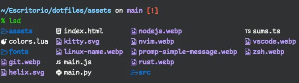
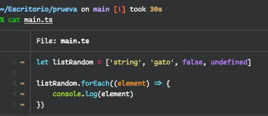
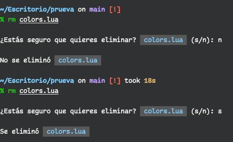

<h1 align="center">
    configuración de Zsh  + Zimfw
</h1>

> Zsh es un potente y versátil intérprete de comandos de Unix con características avanzadas de autocompletado y personalización, para mas detalles visite [Z _shell_](https://zsh.sourceforge.io/).

## Instalar Zsh

Primero actualizamos nuestro sistema: `sudo dnf update`

1. Instamos zsh

   ```shell
   sudo dnf install zsh
   ```

2. Llamamos a zsh desde la terminal, solo escribimos `zsh` y nos lanzara una lista de opciones para generar el archivo de configuración `.zshrc`. Para nuestro caso elegimos una configuración vacía.
3. Ahora tenemos que asegurarnos de que _zsh_ este por default en vez de _bash_.

   ```shell
   sudo usermod --shell /usr/bin/zsh root
   sudo usermod --shell /usr/bin/zsh user
   ```

   > **user** es el usuario de tu sesión. Si no sabes cual es, escribe el comando `whoami`.
   > ejemplo: si tu **usuario** es `marcopolo`.

   ```shell
   sudo usermod --shell /usr/bin/zsh marcopolo
   ```

4. Cerramos la sesión para mostrar los cambios. Busca el botón cerrar sesión o has como un _hack_ y escribe esto en la terminal.
   ```shell
   kill -9 -1
   ```

### lsd

Con mucha frecuencia usamos el comando `ls`, que viene de _list_ o _listar_. Es de lo mas común dentro de todos los muchos y muchos comandos de UNIX.

Lsd es como un `ls`, pero con _esteroides_ o super-poderes. Usa los Glyphos de las fuentes para mostrarnos los iconos de archivos, folders, y todo ello con colores.

<p align="center">
    
</p>

Pero para ello es necesario tener una fuente con _NerdFonts_ en tu Terminal(**kitty**), dejo un enlace con las fuentes parcheadas de [NerdFonts](https://github.com/ryanoasis/nerd-fonts/tree/master/patched-fonts)

Ahora si, Para instalar **lsd**, es tan simple como escribir el comando:

```shell
sudo dnf install lsd
```

Pero eso no es todo: Podemos adaptarlo para usarlo como el `ls` de toda la vida. Para ello usamos los famosos `alias` en nuestro archivo de configuración `.zshrc`.

<details>
    <summary>Alias para lsd</summary>

Copia este código dentro de tu archivo `.zshrc`

```bash
# Alias para 'lsd'
alias ll='lsd -lh --group-dirs=first'
alias la='lsd -a --group-dirs=first'
alias l='lsd --group-dirs=first'
alias lla='lsd -lha --group-dirs=first'
alias ls='lsd --group-dirs=first'
```

</details>

### Bat

Al igual que `lsd`, _bat_ es un `cat` pero con mejor pinta.

Para instalarlo ejecuta el comando:

```shell
sudo dnf install bat
```

Luego también puedes crear un alias para usarlo como un `cat`.

```bash
# Alias para 'bat'
alias cat='bat'
```

Aquí dejo un ejemplo de como se vería.

<p align="center"></p>

### Instalar sudo

Mejor dicho, un autocompletado de **sudo** para tu comando. No te pasa que terminas de escribir el comando y se te olvida _sudo_. Pues para eso esta pequeña guia.

<details>
    <summary>Instalación</summary>

1. navegamos a la ruta `/usr/share` con **`cd /usr/share`** y nos hacemos super usuarios con `sudo su` luego creamos un directorio:

   ```shell
   mkdir zsh-sudo
   ```

2. Ingresamos al folder creado con **`cd zsh-sudo/`** y ya dentro ejecutamos:

   ```shell
   wget https://raw.githubusercontent.com/ohmyzsh/ohmyzsh/master/plugins/sudo/sudo.plugin.zsh
   ```

3. Le asignamos permisos de ejecución con:

   ```shell
   chmod +x sudo.plugin.zsh
   ```

4. Retornamos un paso atrás con `cd ..` y solo para prevenir, cambiamos el usuarios de ese directorio:

   ```shell
   chown user:user -R zsh-sudo
   ```

   > Recuerda que tu usuario (**user**), lo obtienes con el comando `whoami` antes de ser super usuario.

5. Ahora puedes dejar de ser super usuario o _root_, ejecutando `exit`. Ahora solo queda llamar ese plugin escribiendo lo siguiente en tu archivo `.zshrc`:

   ```bash
   # plugin 'sudo'
   source /usr/share/zsh-sudo/sudo.plugin.zsh
   ```

</details>

Para usarlo es tan simple como presionar la tecla **ESC** 2 veces seguidas. Ya no tienes que retroceder al inicio de tu código para completar el `sudo` que habías olvidado.

### Mejorando 'rm -rf'

El comando `rm -rf` es básicamente la orden de _remover de forma recursiva y a la fuerza lo que se indica_. En mi caso me gusta usar este comando y todo genial. Hasta que en un momento mis manitas lo usaron demasiado rápido como para pensar bien. El resultado es que me cargue todo el directorio `/home/usar/.local/`.

El directorio no es tan importante como muchos directorios que si perjudican al sistema. Pero me asuste y con ello se perdieron configuraciones que no sabia que se almacenaban en esa ruta.

Me invente una configuración en mi `.zshrc` para que eso no vuelva a suceder.

<details>
    <summary>Aquí el código</summary>

Pega lo siguiente dentro de tu archivo `.zshrc`.

```bash
# Función para solicitar confirmación antes de ejecutar 'rm -rf'
function confirm_rm() {
  local response

  # Mostrar mensaje de confirmación y obtener respuesta
  echo ""
  read -k "?¿Estás seguro que quieres eliminar? $(tput setab 0)$(tput setaf 6) $* $(tput sgr0) (s/n): " response

  echo

  # Verificar la respuesta
  case "$response" in
    [sS]*)
      # Ejecutar 'rm -rf' si la respuesta comienza con 's' o 'S'
      rm -rf "$@"
      echo ""
      echo "Se eliminó $(tput setab 0)$(tput setaf 6) $* "
      ;;
    [nN]*)
      # Mostrar mensaje de cancelación si la respuesta comienza con 'n' o 'N'
      echo ""
      echo "No se eliminó $(tput setab 0)$(tput setaf 6) $* "
      ;;
    *)
      # Mostrar mensaje de respuesta no válida para otras respuestas
      echo ""
      echo "Respuesta no válida. No se eliminó $(tput setab 0)$(tput setaf 6) $* "
      ;;
  esac
}
alias rm='confirm_rm'
```

</details>

Ahora solo necesitas usar el comando `rm` y especificar lo que quieres borrar. Pero lo que realmente se ejecutara es el comando `rm -rf`. La ventaja de esto es que te preguntara, y siempre puedes pensarlo mejor y declinar. Dejo un ejemplo.

<p align="center"></p>

## Instalar Zimfw

También llamado [Zim](https://github.com/zimfw/zimfw), es un marco de configuración de Zsh que incluye un administrador de complementos , útiles módulos y una amplia variedad de temas , sin comprometer la velocidad.

Aquí nos dejan una imagen para compararlo con otros Frameworks

<p align="center">
    
</p>

Para instalar hay 2 maneras: _automática_ y _manual_, puedes revisar su repositorio y enterarte de que va. Yo realizare la Instalación _automática_ que curiosamente también se hace de 2 formas.

- Con `curl`:

  ```shell
  curl -fsSL https://raw.githubusercontent.com/zimfw/install/master/install.zsh | zsh
  ```

- O con `wget`:

  ```shell
  wget -nv -O - https://raw.githubusercontent.com/zimfw/install/master/install.zsh | zsh
  ```

Eso todo, solo cierras tu Terminal(**kitty**) y ya tendrás cosas como autocompletado, colores al escribir, búsquedas, sugerencias, promp con git, etc....

Toda la configuración esta disponible en un archivo `.zimrc` en la misma ruta que `.zshrc`. Y si no te gusta el tema que trae, siempre puedes optar por alguno de [estos](https://zimfw.sh/docs/themes/), o algún modulo de [estos](https://zimfw.sh/docs/modules/).

Pero, si lo que quieres es el tema de _powerlevel10K_. Agrega esto en tu `.zimrc`.

```bash
zmodule romkatv/powerlevel10k --use degit
```

Y luego ejecuta el comando: `zimfw install` para instalar lo que esta en tu `.zimrc`

**`end...`**
