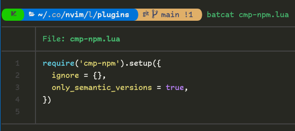
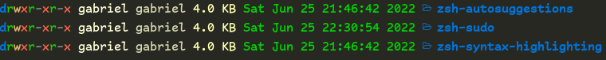

# guia de uso para Zsh 
> Instación: <code>**sudo { apt, dnf } install zsh**</code> o revise para su distribucion.

Llamamos a **zsh** desde la terminal <code>**zsh**</code> y elegimos una opcion de configuracion y generamos el archivo **.zshrc**.

Como aseguramos de que **zsh** este por defecto en el **shell**.

Primero nos aseguramos de estas en bash. <code>**bash**</code>, luego:

```shell
sudo usermod --shell /usr/bin/zsh root
sudo usermod --shell /usr/bin/zsh user
```

Cerramos la sesion para ver el resultado: <code>**kill-9 -1**</code>

Reemplazamos la configuración con la nuestra.

## Instalar lsd
Es como el <code>**ls**</code> para listar dicheros y folders pero con esteroides.

En **Fedora** 
se instala con <code>**sudo dfn install lsd**</code>

En **forks de Debian** 
se descarga el archivo [**lsd-musl_0.xx.x_amd64.deb**](https://github.com/Peltoche/lsd/releases)
y se instala con <code>**sudo dpkg -i rute/lsd_0.xx.x_amd64.deb**</code>

Para las otras distro [**revisar aqui**](https://github.com/Peltoche/lsd).


## Instalar Bat
El mismo cuento, un <code>**cat**</code> pero con con mejor pinta.

Para **Debian y Fedora** seria asi: <code>**sudo { apt, dnf } install bat**</code>, pero para otros les toca revisar [**aqui**](https://github.com/sharkdp/bat).
Para usarlo colocamos en terminal (**kitty**) <code>**bat nameFile.ft**</code> o podria ser <code>**batcat nameFile.ft**</code>, prueve cual le funciona.

Ejemplo <code>**batcat cmp-npm.lua**</code>



Si no te gusta usar <code>**batcat**</code> para esto y aquello. Siempre se puede colocar un alias en su **.zshrc**.

## Instalar highlighting y autosuggestions
Uno suguiere comandos en funcion de lo que se escriba y el otro proporsiona resaltado de sintaxis para **zsh**. Una instalacion para **Debian**  seria asi.
```shell
sudo apt install zsh-syntax-highlighting zsh-autosuggestions
```
Para otras distros puede revisar [**aqui**](https://github.com/zsh-users/zsh-syntax-highlighting/blob/master/INSTALL.md) o [**aqui**](https://github.com/zsh-users/zsh-autosuggestions/blob/master/INSTALL.md#manual-git-clone)

Y para que funcione tendra que llamarlos en su archivo **.zshrc**
```zsh
source /usr/share/zsh-syntax-highlighting/zsh-syntax-highlighting.zsh
source /usr/share/zsh-autosuggestions/zsh-autosuggestions.zsh
```

## Instalar sudo
Mejor dicho, un autocompletado de **sudo**. No te pasa que terminas de escribir el comando y se te olvida del **sudo**. Pues para esto esta aqui.
* navegamos a la ruta <code>**/usr/share**</code>, nos damos permiso <code>**sudo su**</code> y creamos un folder: <code>**mkdir zsh-sudo**</code>
* Ingresamos al folder creado <code>**cd zsh-sudo/**</code> y ya dentro ejecutamos.
  ```shell
  wget https://raw.githubusercontent.com/ohmyzsh/ohmyzsh/master/plugins/sudo/sudo.plugin.zsh
  ```
* Le asignamos permisos de ejecucion <code>**chmod +x sudo.plugin.zsh**</code>
* Retornamos un paso atras <code>**cd ..**</code> y solo para prevenir cambiamos los usuarios de esos 3 plugins: <code>**chown gabriel:gabriel -R zsh-***</code>, asi tambien tendremos acceso a los recursos que esten dentro de esos 3 folders.



Por ultimo lo llamamos a nuestro archivo **.zshrc** <code>**source /usr/share/zsh-sudo/sudo.plugin.zsh**</code>

Asi al olvidarnos del **sudo**, solo tendremos que presionar **<esc\>** por 2 veces seguidas...

## Tema PowerLevel10K
.. continuara...
