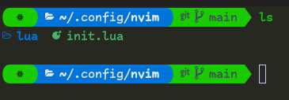

# guia de uso para Zsh 
> Instación: <code>**sudo { apt, dnf } install zsh**</code> o revise para su distribucion.

Llamamos a **zsh** desde la terminal <code>**zsh**</code> y elegimos una opcion de configuracion y generamos el archivo **.zshrc**.

Nos aseguramos de que **zsh** este por defecto en el **shell**: <code>**chsh -s $(which zsh)**</code>

Cerramos la sesion para ver el resultado: <code>**kill-9 -1**</code>

Reemplazamos la configuración con la nuestra.
## Instalar lsd
Es como el <code>**ls**</code> para listar dicheros y folders pero con esteroides.

En **Fedora** 
se instala con <code>**sudo dfn install lsd**</code>

En **forks de Debian** 
se descarga el archivo [**lsd-musl_0.xx.x_amd64.deb**](https://github.com/Peltoche/lsd/releases)
y se instala con <code>**sudo dpkg -i rute/lsd_0.xx.x_amd64.deb**</code>

Para las otras distro [**revisar aqui**](https://github.com/Peltoche/lsd).


## ZIM 
Framework para **zsh**, entre tantos parece ser mas ligero y no pierde en configuraciones.

### Instacion de Zim
* Con **curl**:
  ```bash
  curl -fsSL https://raw.githubusercontent.com/zimfw/install/master/install.zsh | zsh
  ```
* Con **wget**:
  ```bash
  wget -nv -O - https://raw.githubusercontent.com/zimfw/install/master/install.zsh | zsh
  ```
### Configuracion para ZIM
Se reemplaza la Configuracion de **.zimrc** y escribe en terminal <code>**zimfw install**</code> para actualizar los modulos

luego cargara el tema **powerlevel10k** y personalizamos como queramos o copiamos la configuracion de **.p10k.zsh**



aunque requiere de las configuracions de [**kitty**](../kitty) y una fuente parcheada.
